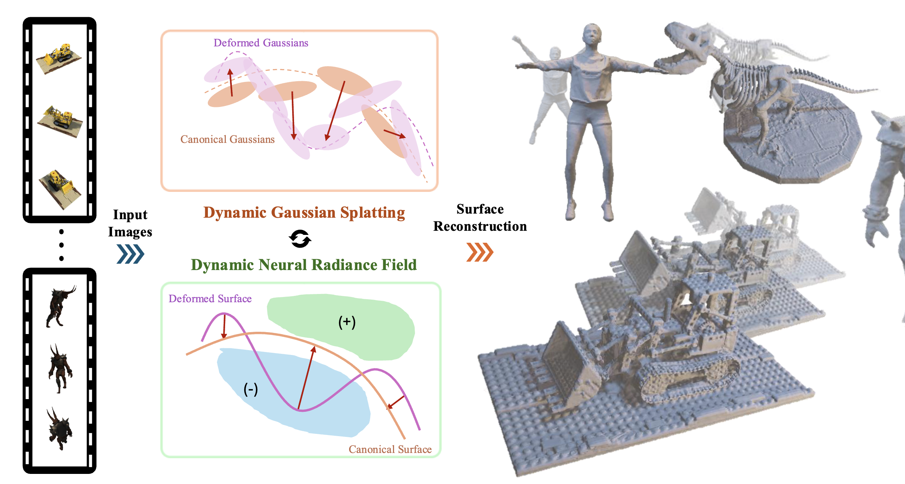

# 🚜 DySurface: Consistent 4D Surface Reconstruction via Bridging Explicit Gaussians and Implicit Functions


[Minje Kim](https://yunminjin2.github.io), [Younghyun Noh], [Jaesoon Kim], [Tae-Kyun Kim](https://sites.google.com/view/tkkim/home)

[](https://yunminjin2.github.io/projects/dysurface/)
[](https://arxiv.org/abs/2605.10360)
<p align='center'>
    
</p>

While novel view synthesis (NVS) for dynamic scenes has seen significant progress, reconstructing temporally consistent geometric surfaces remains a challenge. Neural Radiance Fields (NeRF) and 3D Gaussian Splatting (3DGS) offer powerful dynamic scene rendering capabilities; however, relying solely on photometric optimization often leads to geometric ambiguities. This results in discontinuous surfaces, severe artifacts, and broken surfaces over time. To address these limitations, we present DySurface, a novel framework that bridges the effectiveness of explicit Gaussians with the geometric fidelity of implicit Signed Distance Functions (SDFs) in dynamic scenes. Our approach tackles the structural discrepancy between the forward deformation of 3DGS ($canonical \rightarrow dynamic$) and the backward deformation required for volumetric SDF rendering ($dynamic \rightarrow canonical$). Specifically, we propose the VoxGS-DSDF branch that leverages deformed Gaussians to construct a dynamic sparse voxel grid, providing explicit geometric guidance to the implicit SDF field. This explicit anchoring effectively regularizes the volumetric rendering process, significantly improving surface reconstruction quality, with watertight boundaries and detailed representations. Quantitative and qualitative experiments demonstrate that DySurface significantly outperforms state-of-the-art baselines in geometric accuracy metrics while maintaining competitive rendering performance.

&nbsp;


## Environmental Setting

```
git clone https://github.com/yunminjin2/DySurface.git
cd DySurface

conda create -n trans_gsdf python=3.8
conda activate trans_gsdf
```
1. Install torch (CUDA 11.8).
```
pip install torch==2.1.2 torchvision==0.16.2 --index-url https://download.pytorch.org/whl/cu118
```

2. Install pytorch3d.
```
pip install --no-build-isolation "git+https://github.com/facebookresearch/pytorch3d.git@v0.7.9"
```

3. Install the Gaussian rasterizer and simple-knn.
```
pip install --no-build-isolation "git+https://github.com/graphdeco-inria/diff-gaussian-rasterization.git@dr_aa"
pip install --no-build-isolation "git+https://gitlab.inria.fr/bkerbl/simple-knn.git"
```

4. Install additional requirements.
```
pip install -r requirements.txt
pip install --no-build-isolation "git+https://github.com/NVlabs/tiny-cuda-nn/#subdirectory=bindings/torch"
pip install --no-build-isolation "git+https://github.com/NVlabs/nvdiffrast.git@v0.3.3"
pip install --no-build-isolation "git+https://github.com/mit-han-lab/torchsparse.git@v1.4.0"
```
The CUDA extensions are built with the toolkit at `/usr/local/cuda-11.8`. If it is installed elsewhere, set `CUDA_HOME` (or `DYNAMIC_SURFACE_CUDA_HOME`).

5. Download the [D-NeRF dataset](https://www.dropbox.com/s/0bf6fl0ye2vz3vr/data.zip?dl=0) (from [D-NeRF](https://github.com/albertpumarola/D-NeRF)) and unzip it. Each scene folder should contain `transforms_{train,val,test}.json`.
```
data/
├── bouncingballs/
├── hellwarrior/
├── hook/
├── jumpingjacks/
├── lego/
├── mutant/
├── standup/
└── trex/
```

## Training
Train a scene with its config in `configs/dnerf/{SCENE}_sparse.yaml`. This runs Gaussian pretraining followed by DySurface training.
```
bash train.sh {SCENE} {PATH_TO_DNERF}/{SCENE}
```

(e.g)
```
bash train.sh lego ./data/lego
```

Results are saved in `exp/{SCENE}/{TAG}@{YYYYMMDD-HHMMSS}/` (`ckpt/`, `output/` for Gaussians, `save/` for images/meshes, `tensorboard/`).

- To reuse an already pretrained Gaussian model and skip the GS pretraining stage, give `GS_PRETRAIN_DIR`.
```
GS_PRETRAIN_DIR=exp/lego/release@20260930-080855/output bash train.sh lego ./data/lego
```
- `GPU`, `TAG` (default `release`) and `EXP_DIR` (default `./exp`) can be set as environment variables, and config values can be overridden after the scene path, e.g. `trainer.max_steps=30000`.

## Validation
To validate DySurface, give the experiment folder. The latest checkpoint and Gaussian iteration in the folder are loaded.
```
bash val.sh {FOLDER_PATH_EXPERIMENT}
```

(e.g)
```
bash val.sh exp/lego/release@20260930-080855
```

Use `RESUME={CKPT_PATH}` to choose a specific checkpoint, and `DATA_ROOT={PATH}` if the dataset has been moved.

## Time Rendering
To render the reconstructed Gaussians and meshes over time, use the code below.
```
bash time_render.sh {FOLDER_PATH_EXPERIMENT}
```

(e.g)
```
bash time_render.sh exp/lego/release@20260930-080855
```

The rendered videos (MP4 and GIF) are saved in `{FOLDER_PATH_EXPERIMENT}/save/`.


## Citation

If you find this work useful, please consider citing our paper.

```
@InProceedings{kim2026dysurface,
    author = {Kim, Minje and Noh, Younghyun and Kim, Jaesoon and Kim, Tae-Kyun},
    title = {DySurface: Consistent 4D Surface Reconstruction via Bridging Explicit Gaussians and Implicit Functions},
    booktitle = {Advances in Neural Information Processing Systems (NIPS)},
    year = {2026}
}
```

&nbsp;

## Acknowledgements
 - Our code is based on [GSDF](https://github.com/city-super/GSDF).
